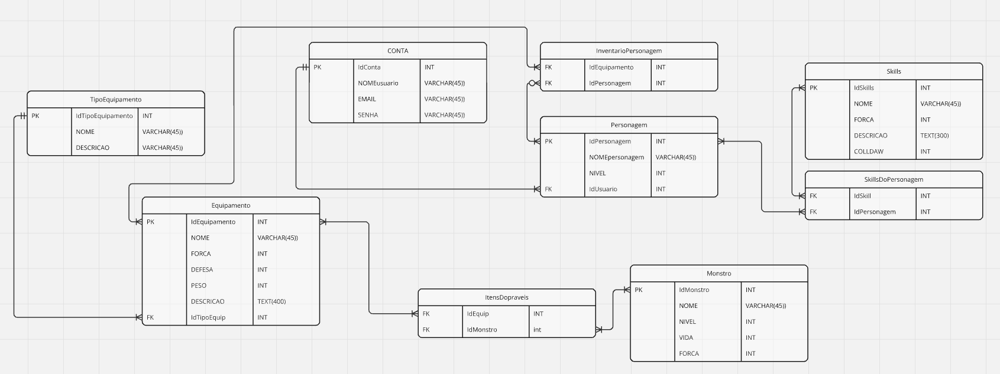

# Banco de Dados RPG

Este repositório é dedicado a um projeto de banco de dados onde estamos criando um jogo RPG.

## Cronograma

## Próximos Passos

1. Criar o arquivo SQL para o banco de dados.
2. Definir as tabelas e relacionamentos.
3. Implementar as funcionalidades do jogo.

## Membros 

1. Caio Henrique Ocon  RA 1958689
2. Breno Henrique RA 1958402
3. Leandro Poletti RA 1982910